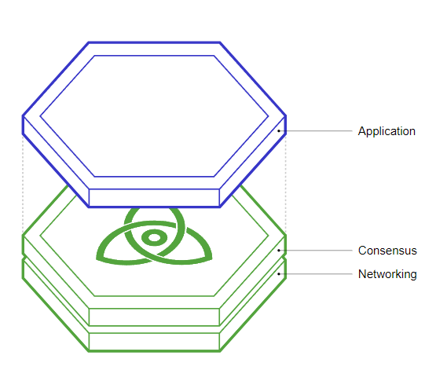

# Cosmos
- [Introduction](#introduction)
## Introduction
### Blockchain

From an architecture standpoint, blockchains can be divided into three conceptual layers

- Application: Responsible for updating the state given a set of transactions, i.e. processing transactions.
- Networking: Responsible for the propagation of transactions and consensus-related messages.
- Consensus: Enables nodes to agree on the current state of the system.

The state machine is the same as the application layer
Application Layer
The Application Layer is the top layer of a blockchain software that defines the state and state-transition function.

It defines the state of the application and the state-transition functions. The other layers are responsible for replicating the state machine on all the nodes that connect to the network.

### Introduction

Strictly speaking, Cosmos is a decentralized network of independent parallel blockchains,
each powered by *BFT* consensus algorithms like *Tendermint* consensus.

### Byzantine Fault-Tolerance (BFT)
BFT stands for Byzantine Fault-Tolerance. Byzantine faults within distributed systems are some of the most difficult to deal with. A Byzantine Fault-Tolerant consensus algorithm guarantees safety for up to a third of Byzantine, or malicious, actors.

## IBC (Inter-Blockchain Communication protocol)

Cosmos SDK is a state-of-the-art blockchain framework that powers the Cosmos Hub 
and its rapidly expanding orbit of sovereign chains.
With Cosmos SDK, you're ready to build innovative applications and 
create value in the internet of blockchains.

## CometBFT

CometBFT is a state machine replication engine for reliable, secure, large-scale, application-specific blockchains.

## Cosmos SDK

The industry standard for building blockchains, Cosmos SDK is built to deliver the best in decentralized technologies: speed. Transaction throughput and latency are core components, and speed is what matters most—no one wants to pay a fee to have their transaction take hours or even days to confirm.

### Tools to extend Cosmos SDK

- [Agoric Swingset](https://docs.agoric.com/)
Agoric's Cosmic SwingSet enables developers to test smart contracts build with ERTP in various blockchain setup environments.

- [CosmWasm](https://docs.cosmwasm.com/deprecated/)
A WASM-based Smart Contract Module for the Cosmos SDK.

- [Ethermint](https://docs.ethermint.zone/)
Ethermint is a software that takes the Ethereum Virtual Machine and turns it into a Cosmos-SDK module. 
This module can be combined with other SDK modules like staking to create fully-functional Proof-of-Stake 
blockchains able to run Ethereum Smart Contracts. Ethermint chains are natively compatible with Cosmos.

## IBC (Inter-blockchain Communications )

The standard protocol for inter blockchain communication, IBC allows blockchains in the ecosystem to connect so that they can transfer tokens and other data between each other frictionlessly and seamlessly.

## Tendermint

Tendermint is both a consensus engine and a BFT consensus algorithm. State-machines can be built in any programming language on top of Tendermint, which takes care of replication.

## Cosmos SDK

The Cosmos SDK is a modular framework that simplifies the process of building secure blockchain applications

Cosmos SDK is a framework for building blockchains in Go. Modular, secure, and fully customizable
Cosmos SDK makes it easy to build complex blockchains on top of Tendermint.

## Cosmos Hub

The Cosmos Hub is the first Hub to launch in the Cosmos Network.
	
## IBC

IBC is the Inter-Blockchain Communication protocol that can be thought of as the TCP/IP for blockchains. IBC allows fast-finality blockchains to exchange value and data with each other in a decentralized way.

## What I learn
- [Developer Portal](https://tutorials.cosmos.network/#developer-resources)
	- 

Ref
- [What is Cosmos?](https://v1.cosmos.network/intro)
- tutorials
	- [tutorials cosmos](https://tutorials.cosmos.network/#developer-resources)
	- [what-is-cosmos?](https://tutorials.cosmos.network/academy/1-what-is-cosmos/)